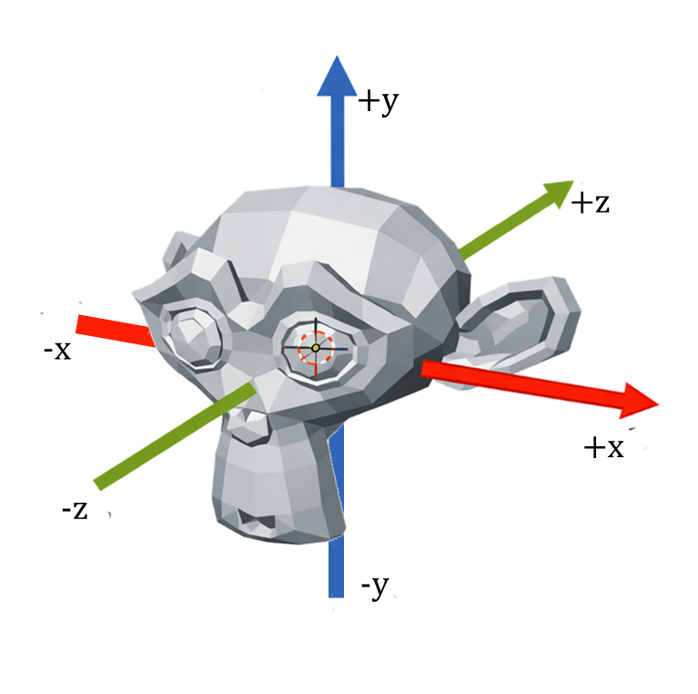

# Guia Prático: Implementação de Câmera Sintética

Este guia descreve a evolução do projeto para suportar visualizações avançadas e navegação interativa, de acordo com o cronograma da Semana 3.

## Parte I - Câmera em Projeção Paralela Ortográfica
Objetivo: Revisar as vistas técnicas e introduzir a Matriz de Visualização (`View`).

**A Grande Mudança (2D para 3D):** Na disciplina anterior, utilizávamos apenas a matriz de projeção ortográfica com planos de corte (`zNear` e `zFar`) entre -1 e 1, sem a necessidade de posicionar uma câmera. Agora, no pipeline 3D real, **precisamos explicitamente de uma matriz de `View`** para definir de onde estamos olhando, mesmo em projeção ortográfica!

**Configuração:** O objeto está na origem `(0,0,0)`. Como nosso eixo Z cresce para trás do objeto, posicionaremos a câmera em `(0, 0, -3)` para olharmos de frente para ele.



> **1. A Matriz de Projeção (Ortográfica):**
> Note que agora os planos de corte Z (`near` e `far`) precisam acomodar a distância da nossa câmera.
> ```cpp
> glm::mat4 projection = glm::ortho(-10.0f, 10.0f, -10.0f, 10.0f, 0.1f, 100.0f);
> ```

> **2. A Matriz de Visualização (View):**
> Implemente uma lógica de teclado (por exemplo, teclas 1 a 6) para alternar entre as vistas usando a função `glm::lookAt(posição, alvo, up)`:
> 
> * **Frente:** `view = glm::lookAt(glm::vec3(0,0,-3), glm::vec3(0,0,0), glm::vec3(0,1,0));`
> * **Fundo:** `view = glm::lookAt(glm::vec3(0,0,3), glm::vec3(0,0,0), glm::vec3(0,1,0));`
> * **Topo:** `view = glm::lookAt(glm::vec3(0,3,0), glm::vec3(0,0,0), glm::vec3(0,0,-1));` // Rosto (-Z) aponta para cima na tela
> * **Debaixo:** `view = glm::lookAt(glm::vec3(0,-3,0), glm::vec3(0,0,0), glm::vec3(0,0,-1));` // Rosto (-Z) aponta para cima na tela
> * **Lateral Direita:** `view = glm::lookAt(glm::vec3(3,0,0), glm::vec3(0,0,0), glm::vec3(0,1,0));`
> * **Lateral Esquerda:** `view = glm::lookAt(glm::vec3(-3,0,0), glm::vec3(0,0,0), glm::vec3(0,1,0));`

---

## Parte II 
### Projeção Perspectiva Estática

> Objetivo: Entender a profundidade e a relação entre as matrizes de projeção e visualização.

1. Altere a matriz de projeção para perspectiva:
   ```cpp
   glm::mat4 projection = glm::perspective(glm::radians(45.0f), (float)width/(float)height, 0.1f, 100.0f);
   ```

2. Defina a matriz de visualização (`view`). Para posicionar a câmera em `(0, 0, -3)`, nós transladamos o cenário na direção oposta. Comece aplicando uma translação simples, e depois evolua para a função `lookAt` para facilitar a parametrização:
   ```cpp
   // 1. Abordagem inicial (translação do mundo na direção oposta à câmera):
   glm::mat4 view = glm::translate(glm::mat4(1.0f), glm::vec3(0.0f, 0.0f, 3.0f));
   
   // 2. Evolução para a função lookAt (Câmera em -3, olhando para a origem):
   // view = glm::lookAt(glm::vec3(0.0f, 0.0f, -3.0f), glm::vec3(0.0f, 0.0f, 0.0f), glm::vec3(0.0f, 1.0f, 0.0f));
   ```

---

### Navegação (Teclado WASD)
Objetivo: Implementar translação da câmera no espaço 3D.

No `key_callback`, atualize a `cameraPos` baseada nos vetores diretores:
* **W / S:** `cameraPos += cameraFront * speed` (Frente/Trás)
* **A / D:** `cameraPos -= glm::normalize(glm::cross(cameraFront, cameraUp)) * speed` (Esquerda/Direita)

---

### Rotação (Mouse e Ângulos de Euler)
Objetivo: "Olhar ao redor" controlando os ângulos Pitch e Yaw.

* **Yaw (Guinada):** Rotação no eixo Y. Inicialize em `90.0f` para que a câmera aponte em direção à origem (`+Z`).
* **Pitch (Arfagem):** Rotação no eixo X. Limite a rotação entre `[-89.0f, 89.0f]`.

**Cálculo do vetor Front:**
```cpp
front.x = cos(glm::radians(yaw)) * cos(glm::radians(pitch));
front.y = sin(glm::radians(pitch));
front.z = sin(glm::radians(yaw)) * cos(glm::radians(pitch));
cameraFront = glm::normalize(front);
```

---

## Desafio de Aula
Encapsular toda essa lógica (matrizes, vetores e ângulos) em uma classe `Camera.h` para que possamos reutilizá-la no Trabalho do Grau A.
